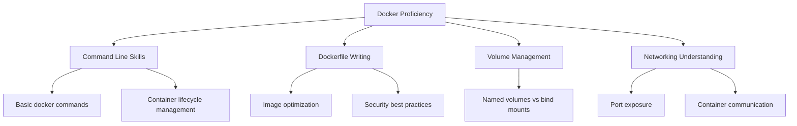

# Learning Design Document: Docker Basics

## Lesson Overview

This comprehensive learning module will teach Docker fundamentals from basic concepts to practical application. The module uses a progressive, hands-on approach that builds understanding through practical examples and interactive exercises. The design emphasizes clear explanations, real-world analogies, and immediate practice to reinforce learning.

**Research-informed approach:** Based on analysis of Docker documentation and community resources, this design addresses common misconceptions (e.g., containers vs. virtual machines, data persistence issues) and emphasizes practical application over theoretical concepts. Key findings show that beginners often struggle with installation, understanding the difference between images and containers, and data persistence concepts.

## Module Flow & Structure

### Phase 1: Foundation (20% of time)
1. **Understanding Docker Fundamentals** - What is containerization, Docker vs. VMs
2. **Installing and Setting Up Docker** - Getting Docker running on your machine
3. **Docker Architecture Overview** - Understanding the Docker ecosystem

### Phase 2: Core Operations (40% of time)
4. **Basic Docker Commands** - `docker run`, `docker ps`, `docker stop`
5. **Working with Images** - Pulling, listing, and removing images
6. **Container Lifecycle Management** - Creating, starting, stopping, removing containers

### Phase 3: Building and Customizing (25% of time)
7. **Creating Dockerfiles** - Building custom images
8. **Data Persistence with Volumes** - Managing data in containers
9. **Networking Basics** - Container communication and port exposure

### Phase 4: Advanced Topics & Best Practices (15% of time)
10. **Docker Compose** - Managing multi-container applications
11. **Troubleshooting and Debugging** - Common issues and solutions
12. **Best Practices** - Image optimization and security considerations

```mermaid
graph LR
    A[Docker Fundamentals] --> B[Installation & Setup]
    B --> C[Basic Commands]
    C --> D[Working with Images]
    D --> E[Container Management]
    E --> F[Creating Dockerfiles]
    F --> G[Data Persistence]
    G --> H[Networking]
    H --> I[Docker Compose]
    I --> J[Troubleshooting]
    J --> K[Best Practices]
```



## Learning Components

### Theoretical Components (30%)
- **Interactive Explanations**: Clear, concise text with embedded command examples
- **Visual Diagrams**: Architecture diagrams, container vs. VM comparisons
- **Concept Maps**: Visual representations of Docker concepts and relationships
- **Real-world Analogies**: Comparing containers to shipping containers, images to blueprints

### Practical Components (50%)
- **Live Command Examples**: Step-by-step command execution with explanations
- **Interactive Exercises**: Hands-on practice with each Docker command
- **Step-by-Step Tutorials**: Guided building of Dockerfiles and docker-compose files
- **Real Project Examples**: Simple web applications containerized with Docker

### Assessment Components (20%)
- **Knowledge Checks**: Quick quizzes after each major concept
- **Hands-on Challenges**: Practical exercises to solve real Docker problems
- **Project Building**: Progressive development of a complete containerized application
- **Debugging Scenarios**: Identifying and fixing common Docker issues

## Core Code Examples

### Example 1: First Container Experience
```bash
# Run your first container
docker run hello-world

# Run an interactive Ubuntu container
docker run -it ubuntu /bin/bash

# Run a container in the background
docker run -d nginx
```

### Example 2: Basic Dockerfile
```dockerfile
# Use an official Python runtime as a parent image
FROM python:3.9-slim

# Set the working directory in the container
WORKDIR /app

# Copy the current directory contents into the container at /app
COPY . /app

# Install any needed packages specified in requirements.txt
RUN pip install --no-cache-dir -r requirements.txt

# Make port 80 available to the world outside this container
EXPOSE 80

# Define environment variable
ENV NAME World

# Run app.py when the container launches
CMD ["python", "app.py"]
```

### Example 3: Data Volume Demonstration
```bash
# Create a named volume
docker volume create myapp_data

# Run a container with the volume
docker run -d -v myapp_data:/data nginx

# Use bind mounts for development
docker run -d -v "$(pwd)":/usr/share/nginx/html nginx
```

### Example 4: Simple docker-compose.yml
```yaml
version: '3.8'
services:
  web:
    build: .
    ports:
      - "5000:5000"
    volumes:
      - .:/code
    environment:
      FLASK_ENV: development
  redis:
    image: "redis:alpine"
```

## Addressing Common Misconceptions

### 1. Containers vs. Virtual Machines
- **Misconception**: "Containers are just lightweight VMs"
- **Solution**: Visual comparison showing containers share the host OS kernel
- **Teaching**: Use the apartment building analogy - VMs are like separate buildings, containers are like apartments in one building

### 2. Data Persistence
- **Misconception**: "Data in containers is automatically saved"
- **Solution**: Demonstrate data loss when containers are removed
- **Memory aid**: "Containers are ephemeral - volumes make data permanent"

### 3. Images vs. Containers
- **Misconception**: "Images and containers are the same thing"
- **Solution**: Class analogy - Images are like classes, containers are like instances
- **Visual**: Show the relationship: image → (docker run) → container

### 4. Installation Issues
- **Misconception**: "Docker installation is the same across all systems"
- **Solution**: Platform-specific installation guides with troubleshooting
- **Common issues**: Address WSL2 requirements, virtualization issues, permissions

## Assessment Strategy

### Formative Assessments (During Learning)
- **Command Knowledge Checks**: "What does this command do?"
- **Debugging Exercises**: "Fix this Dockerfile"
- **Scenario-based Questions**: "How would you persist data in this situation?"
- **Quick Quizzes**: Multiple choice questions on key concepts

### Summative Assessments (End of Module)
- **Practical Project**: Containerize a simple web application
- **Dockerfile Challenge**: Optimize a given Dockerfile
- **Multi-container App**: Create a docker-compose setup
- **Troubleshooting Test**: Identify and fix common Docker issues

### Assessment Rubric


## Learning Environment & Tooling

### Required Software
- **Docker Desktop** or **Docker Engine**: Latest stable version
- **Command Line Interface**: Terminal or command prompt
- **Text Editor**: VS Code, Sublime Text, or similar
- **Git**: For version control (optional but recommended)

### Recommended Tools
- **VS Code with Docker Extension**: For Dockerfile syntax highlighting and management
- **Docker Hub Account**: For pushing and pulling images
- **Postman or curl**: For testing web services in containers

### Development Setup
```bash
# Verify Docker installation
docker --version
docker-compose --version

# Test Docker is running
docker run hello-world

# Create a practice directory
mkdir docker-practice
cd docker-practice
```

## Pedagogical Decisions & Rationale

### 1. Hands-First Approach
**Decision**: Start with practical commands before deep theory
**Rationale**: Adult learners learn best by doing, builds confidence through immediate success

### 2. Progressive Complexity
**Decision**: Each concept builds on previous knowledge
**Rationale**: Prevents cognitive overload and ensures solid foundation

### 3. Real-World Context
**Decision**: Use practical, relatable examples
**Rationale**: Increases engagement and demonstrates immediate value

### 4. Common Mistakes Proactive Addressing
**Decision**: Address misconceptions before they become habits
**Rationale**: Reduces frustration and debugging time later

### 5. Platform-Specific Guidance
**Decision**: Provide installation help for major platforms
**Rationale**: Installation is a common barrier to getting started

### 6. Visual Learning Support
**Decision**: Include diagrams and visual aids
**Rationale**: Docker concepts are abstract and benefit from visual representation

---

This design document addresses all requirements from the specification while incorporating research-backed teaching methods for effective technical education. The module balances theory with practice and prepares learners for real-world Docker usage.