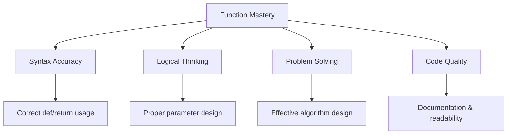

# Learning Design Document: Functions in Python

## Lesson Overview

This comprehensive learning module will teach Python functions from basic concepts to advanced features. The module uses a progressive, hands-on approach that builds understanding through practical examples and interactive exercises. The design emphasizes clear explanations, real-world analogies, and immediate practice to reinforce learning.

**Research-informed approach:** Based on analysis of Python education resources, this design addresses common misconceptions (e.g., parameters vs. arguments, mutable default arguments) and emphasizes practical application over theoretical concepts.

## Module Flow & Structure

### Phase 1: Foundation (25% of time)
1. **Introduction to Functions** - Why functions matter, basic analogy
2. **Function Definition & Basic Syntax** - `def` keyword, function anatomy
3. **Simple Function Calls** - Invoking functions, understanding execution flow

### Phase 2: Core Concepts (40% of time)
4. **Parameters and Arguments** - Positional arguments, understanding data flow
5. **Return Values** - The `return` statement, getting data back from functions
6. **Variable Scope** - Local vs. global variables, the LEGB rule
7. **Function Documentation** - Writing effective docstrings

### Phase 3: Advanced Features (25% of time)
8. **Default Parameters** - Optional arguments, best practices
9. **Variable Arguments** - `*args` and `**kwargs` for flexibility
10. **Advanced Function Types** - Lambda functions, closures

### Phase 4: Best Practices & Applications (10% of time)
11. **Function Design Principles** - Single responsibility, readability
12. **Real-world Applications** - Practical examples and mini-projects

```mermaid
graph LR
    A[Introduction] --> B[Basic Definition]
    B --> C[Function Calls]
    C --> D[Parameters & Arguments]
    D --> E[Return Values]
    E --> F[Variable Scope]
    F --> G[Documentation]
    G --> H[Default Parameters]
    H --> I[Variable Arguments]
    I --> J[Advanced Types]
    J --> K[Best Practices]
```



## Learning Components

### Theoretical Components (30%)
- **Interactive Explanations**: Clear, concise text with embedded code examples
- **Visual Diagrams**: Flowcharts showing function execution, scope diagrams
- **Concept Maps**: Visual representations of relationships between concepts
- **Real-world Analogies**: Comparing functions to recipes, factory machines, etc.

### Practical Components (50%)
- **Live Code Examples**: Editable, runnable code snippets for each concept
- **Interactive Exercises**: Fill-in-the-blank, debugging, and function-writing challenges
- **Step-by-Step Tutorials**: Guided building of practical functions
- **Code Along Sessions**: Video-style walkthroughs of function creation

### Assessment Components (20%)
- **Knowledge Checks**: Quick quizzes after each major concept
- **Coding Challenges**: Progressive difficulty problems to solve
- **Peer Review**: Code review exercises for learning from others
- **Capstone Project**: Small application using all learned concepts

## Core Code Examples

### Example 1: Basic Function with Clear Analogy
```python
def make_coffee(type_of_coffee="espresso", size="medium"):
    """
    Makes a virtual coffee order.
    
    Like a coffee machine, this function takes preferences (parameters)
    and returns a customized result.
    """
    return f"Here's your {size} {type_of_coffee}! ☕"

# Usage examples
print(make_coffee())  # Default order
print(make_coffee("latte", "large"))  # Custom order
```

### Example 2: Function with Return Value and Multiple Parameters
```python
def calculate_rectangle_area(length, width):
    """
    Calculates the area of a rectangle.
    
    Demos: Multiple parameters, calculation, explicit return
    """
    area = length * width
    return area

# Interactive exploration
room_area = calculate_rectangle_area(12, 10)
print(f"Room area: {room_area} square feet")
```

### Example 3: Function Demonstrating Scope and Mutable Defaults (Common Pitfall)
```python
# ❌ Common mistake - mutable default
def add_item_poorly(item, cart=[]):
    cart.append(item)
    return cart

# ✅ Correct approach
def add_item_correctly(item, cart=None):
    if cart is None:
        cart = []
    cart.append(item)
    return cart
```

### Example 4: Advanced Function with *args and **kwargs
```python
def create_profile(name, *hobbies, **details):
    """
    Creates a user profile with flexible options.
    
    Demos: Positional args, variable args, keyword args
    """
    profile = {"name": name, "hobbies": list(hobbies)}
    profile.update(details)
    return profile

# Usage examples
user1 = create_profile("Alice", "reading", "coding", age=25, city="NYC")
user2 = create_profile("Bob", "gaming", location="LA")
```

## Addressing Common Misconceptions

### 1. Parameters vs. Arguments
- **Misconception**: "Parameters and arguments are the same thing"
- **Solution**: Clear visual distinction using a recipe analogy
- **Teaching**: "Parameters are the ingredient names in the recipe; arguments are the actual ingredients you use"

### 2. Mutable Default Arguments
- **Misconception**: "Default values are created fresh each time"
- **Solution**: Demonstrate the problem, then show the `None` pattern
- **Memory aid**: "Default defaults stay the same - use None to start anew"

### 3. Return Statement Behavior
- **Misconception**: "All functions must return something" or "Print is the same as return"
- **Solution**: Side-by-side examples showing `print()` vs `return()`
- **Analogy**: "Print is like telling someone information; return is like handing them an object"

### 4. Variable Scope
- **Misconception**: "Variables inside functions are available everywhere"
- **Solution**: Visual scope diagrams with the "LEGB" rule (Local, Enclosing, Global, Built-in)
- **Memory aid**: "Local variables are like function-private notes"

## Assessment Strategy

### Formative Assessments (During Learning)
- **Quick Knowledge Checks**: 3-5 question quizzes after each concept
- **Code Reading Exercises**: "What will this code output?" problems
- **Debugging Challenges**: Find and fix errors in existing functions
- **Pair Programming**: Collaborative function-writing exercises

### Summative Assessments (End of Module)
- **Function Building Project**: Create a set of functions for a practical application
- **Code Review Exercise**: Analyze and improve provided functions
- **Multiple Choice Test**: Comprehensive knowledge assessment
- **Practical Coding Challenge**: Build a small utility library

### Assessment Rubric


## Learning Environment & Tooling

### Required Software
- **Python 3.9+**: Latest stable version with full feature support
- **VS Code**: Recommended IDE with Python extension
- **Jupyter Notebooks**: Optional for interactive exploration
- **Git**: Version control for code management

### Recommended Extensions/Tools
- **Python IntelliSense**: Autocompletion and error detection
- **Code Runner**: Quick execution of Python snippets
- **Python Docstring Generator**: Automated documentation
- **Black**: Code formatter for consistent style

### Development Setup
```bash
# Recommended virtual environment setup
python -m venv functions-learning
source functions-learning/bin/activate  # Linux/Mac
# OR
functions-learning\Scripts\activate  # Windows

# Install useful packages
pip install pytest black mypy
```

## Pedagogical Decisions & Rationale

### 1. Progressive Complexity
**Decision**: Start with concrete examples before abstract concepts
**Rationale**: Reduces cognitive load and builds confidence gradually

### 2. Immediate Practice
**Decision**: Every concept followed by hands-on exercise
**Rationale**: Based on research showing immediate application improves retention

### 3. Common Mistakes First
**Decision**: Address misconceptions before they become habits
**Rationale**: Preventive teaching reduces debugging frustration later

### 4. Real-world Context
**Decision**: Use practical, relatable examples
**Rationale**: Increases engagement and demonstrates practical value

### 5. Visual Learning Support
**Decision**: Include diagrams and visual aids
**Rationale**: Accommodates different learning styles and improves understanding

---

This design document addresses all requirements from the specification while incorporating research-backed teaching methods for effective programming education. The module balances theory with practice and prepares learners for real-world Python development.