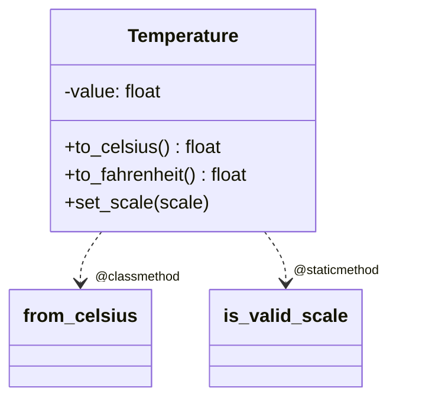

# Learning Design: Methods in Python

## Lesson Overview

Goal: Enable beginners to confidently understand, use, and design Python methods across instance, class, and static contexts; work fluently with built-in type methods; and apply special (dunder) methods to integrate with Python protocols. Teaching approach: scaffolded progression from concrete built-in methods to authoring methods in user-defined classes, then extend to advanced topics (decorators for methods, properties, inheritance, dunder methods). Emphasis on mental models (object binding, `self`, mutability), frequent short practice, and misconception checks.

Success criteria are aligned with all requirements in `requirements.md`.

## Module Flow & Structure

1. Orientation: Method vs function, dot-call mental model
2. Instance methods and `self`: reading/writing state
3. Designing your own class with methods
4. Method parameters: positional, keyword, defaults, *args/**kwargs
5. Return values vs side effects; mutability
6. Built-in type methods: `str`, `list`, `dict`, `set` (tour of essentials)
7. Method taxonomy: instance vs `@classmethod` vs `@staticmethod`
8. Special (dunder) methods: `__init__`, `__str__`/`__repr__`, `__len__`, comparisons
9. Inheritance: overriding, extending with `super()`
10. Binding and scopes: bound vs unbound, name lookup
11. Encapsulation conventions: `_name` and `__name` (name mangling)
12. Method decorators and properties (`@property`, setters)
13. Errors and contracts: raising/handling exceptions in methods; docstrings
14. Type hints for methods; fluent interfaces and chaining
15. Synthesis: build a small class-based mini-project using multiple method kinds

Mermaid overview of learning flow:

```mermaid
flowchart TD
  A[Method vs Function] --> B[Instance Methods & self]
  B --> C[Design a Class]
  C --> D[Parameters & Args]
  D --> E[Returns & Side Effects]
  E --> F[Built-in Methods Tour]
  F --> G[Instance vs Class vs Static]
  G --> H[Dunder Methods]
  H --> I[Inheritance & super()]
  I --> J[Binding & Scopes]
  J --> K[Encapsulation Conventions]
  K --> L[Properties & Decorators]
  L --> M[Errors & Docstrings]
  M --> N[Type Hints & Chaining]
  N --> O[Synthesis Project]
```

## Learning Components

- Concept mini-lectures: short explanations anchored in concrete examples.
- Interactive REPL tasks: learners execute small snippets to observe behavior.
- Visual aids: diagrams for binding (`obj.method` -> function + instance = bound method), attribute access, MRO.
- Worked examples: show typical mistakes and how to fix them.
- Practice exercises: 5–10 minute tasks after each section.
- Formative quizzes: quick checks for misconceptions.
- Reflection prompts: ask learners to explain `self` or decide method type.

## Core Code Examples (descriptions)

1. Dot-call model
   - Show `len(name)` vs `name.upper()` to contrast function vs method.
   - Inspect method object: `type(str.upper)`, `type(name.upper)` to see function vs bound method.
2. Instance methods and `self`
   - Simple `Counter` class with `increment`, `reset`, reading/writing `self.value`.
3. Parameters
   - `Vector.add(other, scale=1.0, *extras, **opts)` to exercise binding of args and defaults.
4. Returns vs side effects
   - `list.sort()` (in-place, returns None) vs `sorted(list)` (returns new list) comparison.
5. Built-in methods tour
   - `str.strip`, `str.split`, `list.append/extend`, `dict.get/update`, `set.add/remove` task bank.
6. Class vs static methods
   - `Temperature.from_celsius` as `@classmethod` factory; `is_valid_scale` as `@staticmethod` utility.
7. Dunder methods
   - `__repr__` vs `__str__` difference; `__len__` enabling `len(obj)`; `__eq__` for comparisons.
8. Inheritance
   - `Animal.speak` overridden in `Dog`; use `super().__init__` to extend base.
9. Properties
   - `@property` with validation in setter; preventing invalid state.
10. Errors and docstrings
    - Raise `ValueError` in setters; write NumPy/Google-style docstrings.
11. Type hints and chaining
    - Annotate methods; return `self` for fluent API, discuss trade-offs.

Class relationships diagram:



## Addressing Common Misconceptions

- `self` is not a keyword; it is an explicit first parameter bound to the instance.
- Methods vs functions: dot-call binds the instance to the function producing a bound method (`obj.method`), which passes the instance as the first argument when called.
- Default mutable parameters: avoid `def f(x=[])`; use `None` sentinel.
- In-place vs returning new object: e.g., `list.sort()` vs `sorted(list)`.
- `@staticmethod` vs `@classmethod`: static has no `cls` and doesn’t access class state; classmethod receives `cls` and is suited for factories/alternate constructors.
- `__str__` vs `__repr__`: `__repr__` is for developers, aims to be unambiguous; `__str__` is for users, human-readable.
- Name mangling with `__attr`: not true privacy, but avoids accidental override.
- Argument passing model: Python uses “assignment/passing by object reference”; mutability affects observable side effects.

## Assessment Strategy

- Frequent micro-quizzes (2–3 items) after each segment.
- Coding challenges:
  - Implement `Counter` with methods and property validation.
  - Build `Temperature` with `@classmethod` factory and `@staticmethod` validator.
  - Add `__repr__`, `__len__`, `__eq__` to a custom container.
- Reflection questions: Explain when to choose `@classmethod` over `@staticmethod`.
- Final mini-project: A small library (e.g., `TodoList`) using instance methods, properties, error handling, type hints, at least one dunder method, and a fluent method.
- Rubrics aligned with acceptance criteria in `requirements.md`.

## Learning Environment & Tooling

- Python 3.10+
- Editor: VS Code (Python extension) or any REPL-friendly environment
- Tools: `python -i` REPL, or Jupyter for quick exploration
- Linter/type checker: `ruff` or `flake8`; `mypy` for types (optional but encouraged)

## Research Plan and Key Findings (embedded)

Questions investigated:
- How to explain `self` and bound methods effectively?
- What misconceptions do beginners have about in-place vs returned results?
- When to choose `@classmethod` vs `@staticmethod`?
- Best practices for dunder methods and docstrings for novices?

Findings and how they shape the design:
- Python data model makes objects integrate via special methods; teaching `__repr__`, `__len__`, comparison early improves understanding of “protocols” (Python Docs).
- Beginners conflate functions and methods; visualizing binding and showing `list.sort()` vs `sorted()` clarifies side effects and return semantics (Official tutorial, Real Python).
- `@classmethod` for factories is a widely taught pattern; using a temperature conversion example provides a concrete, low-cognitive-load scenario (Fluent Python, Python Docs).
- Properties provide safer state transitions; adding validation patterns prevents invalid object states and demonstrates encapsulation (Python Docs).

Cited sources:
- Python Docs: The Python Tutorial — Classes, Data Model, Built-in Types
  - https://docs.python.org/3/tutorial/classes.html
  - https://docs.python.org/3/reference/datamodel.html
  - https://docs.python.org/3/library/stdtypes.html
- Real Python: Instance, Class, and Static Methods
  - https://realpython.com/instance-class-and-static-methods-demystified/
- Fluent Python (2nd ed.), Ramalho — chapters on data model and protocols
- PEP 8 — naming conventions: https://peps.python.org/pep-0008/
- Google Python Style Guide (docstrings): https://google.github.io/styleguide/pyguide.html#38-comments-and-docstrings

## Pedagogical Decisions and Rationales

- Start with built-in methods to ground abstract ideas in familiar objects, then move to user-defined classes to transfer the mental model.
- Delay decorators (`@classmethod`, `@staticmethod`, `@property`) until after instance methods to reduce intrinsic cognitive load.
- Use REPL-driven discovery to surface binding behavior, then formalize the concept.
- Explicitly contrast in-place vs pure-return operations to avoid persistent confusion.
- Integrate small assessment after each step to enable retrieval practice and spacing.

## Mapping to Requirements

Each section of the flow corresponds one-to-one with items 1–16 in `requirements.md`, ensuring coverage of: basics, `self`, class design, parameters, returns/side effects, built-ins, method taxonomy, dunders, inheritance/override, binding & scopes, encapsulation, properties, error handling, docstrings/contracts, typing, and method chaining.
